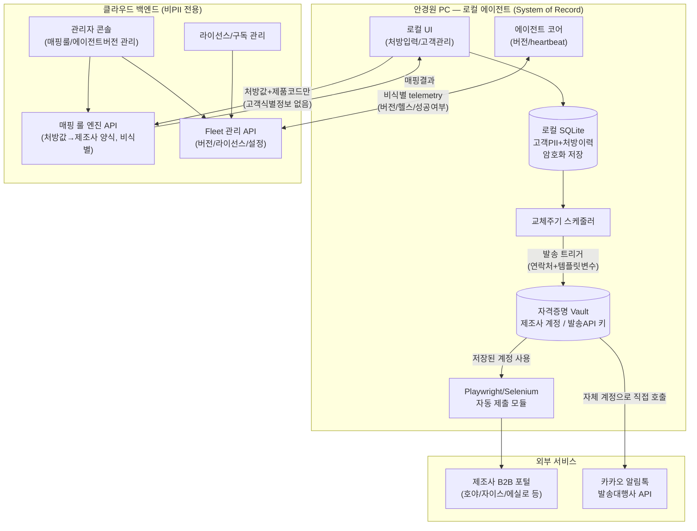

# 기술 스펙 정의

> 관련 문서: [서비스 기획서](./01-service-plan.md) · [로드맵](./02-roadmap.md)
>
> 이 문서의 모든 설계는 기획서 5장의 데이터 프라이버시 4원칙(무저장 / 최소 전송 / 발송 경로 직결 / 서버엔 비식별만)을 최우선 제약으로 따른다.

## 1. 전체 아키텍처 개요

**핵심**: `DB`(고객 PII)에서 나가는 화살표는 `Sched → Vault → Kakao` 한 줄뿐이며, 이마저 당사 `Cloud` 박스를 거치지 않는다. `Cloud`로 향하는 모든 화살표는 비식별 데이터만 지난다.

## 2. 컴포넌트별 상세

### 2.1 로컬 에이전트 (Local Agent)

- **역할**: 고객 데이터의 실질적 저장소(system of record). 처방 입력, 발주 변환 요청, 자동 제출, 교체주기 계산, 알림톡 발송 트리거, 에이전트 자기 업데이트를 담당.
- **기술 스택(권장)**: Python 3.x 코어(README의 Python 방향과 일치) + 로컬 웹 UI(`FastAPI` + `pywebview`로 감싸거나, 시스템 기본 브라우저로 `localhost` 접속) + `Playwright`(자동 제출) + `PyInstaller`(Windows 설치파일 패키징 — 안경원 POS 환경은 Windows 비중이 높다고 가정).
- **로컬 DB(개략 스키마)**:
  - `customers(id, name, phone, birth_year, created_at)`
  - `prescriptions(id, customer_id, sph, cyl, axis, add, pd, lens_type, measured_at)`
  - `orders(id, customer_id, manufacturer, prescription_id, status, submitted_at)`
  - `replacement_schedules(id, customer_id, due_date, cycle_months, last_notified_at)`
  - `credentials_vault(id, target, encrypted_payload)` — 제조사 포털 계정, 알림톡 발송대행사 API 키
  - `agent_meta(installed_version, store_id, agent_instance_id, last_heartbeat_at)`
- **보안**: DB는 `SQLCipher` 등으로 암호화, 암호화 키는 OS 자격증명 관리자(Windows Credential Manager / `keyring` 라이브러리)에 보관. 이 로컬 DB는 클라우드로 백업/동기화하지 않는 것을 기본값으로 한다.

### 2.2 클라우드 백엔드

- **원칙**: 스키마 자체에 고객 PII 필드를 두지 않는다(설계로 원천 차단). PII가 들어올 수 있는 필드는 코드 리뷰/스키마 리뷰 단계에서 금지.
- **모듈**:
  1. **매핑 룰 엔진 API** — 입력: 처방값+제품코드+대상 제조사. 출력: 매핑된 파일/파라미터. 요청 로그에도 PII가 없으므로 안전하게 감사 로그를 남길 수 있다.
  2. **Fleet 관리 API** — 에이전트 등록, 버전 배포, 라이선스/기능 플래그, heartbeat 수신(비식별 운영 지표만).
  3. **관리자 콘솔(내부용)** — 매핑 룰 편집/버전 관리, 에이전트 버전 릴리스 관리, 안경원 계정/라이선스 관리, Fleet 헬스 대시보드. 최종 고객(안경원의 고객) 데이터는 이 콘솔에 애초에 존재하지 않는다.
  4. **라이선스/구독 관리** — 안경원(사업자) 단위 계정. 여기의 "연락처"는 원장님(계약 당사자)의 사업자 연락처로, 최종 소비자 PII와는 성격이 다른 B2B 계약 정보다 — 이 구분을 스키마/문서상 명확히 분리해 혼동을 막는다.
- **DB(개략 스키마, PostgreSQL 권장)**:
  - `stores(id, biz_name, owner_contact, plan, created_at)`
  - `agents(id, store_id, agent_instance_id, installed_version, last_heartbeat_at, status)`
  - `mapping_rules(id, manufacturer, version, schema_json, published_at)`
  - `agent_releases(id, version, artifact_url, released_at, min_supported)`
  - `telemetry_events(id, agent_id, event_type, payload_nonpii, created_at)`

### 2.3 관리자 콘솔 vs 안경원용 로컬 UI

두 UI를 혼동하지 않도록 명확히 분리한다.

| | 관리자 콘솔 | 로컬 에이전트 UI |
|---|---|---|
| 사용자 | 서비스 운영팀(우리) | 안경사(원장) |
| 위치 | 클라우드(웹) | 안경원 PC(localhost) |
| 다루는 데이터 | 매핑룰, 에이전트 버전, 안경원 계정/라이선스 | 고객 PII, 처방이력, 발송 이력 |

## 3. 정보 활용 구조 (데이터 흐름 상세)

| 데이터 종류 | 저장 위치 | 전송 대상 | 전송 시점/목적 | 보존 정책 |
|---|---|---|---|---|
| 처방데이터(SPH/CYL/AXIS/ADD/PD) | 로컬 | 클라우드 매핑 API | 발주 변환 요청 시 | 서버는 응답 후 요청 페이로드 미저장(또는 비식별 감사로그만) |
| 고객 이름/연락처 | 로컬만 | 카카오 발송대행사(직접) | 알림톡 발송 시점 | 서버 미경유가 원칙, 영구 보관은 로컬에서만 |
| 처방 이력/교체주기 | 로컬만 | — | — | 로컬 DB, 서버 전송 없음 |
| 제조사 포털 계정정보 | 로컬 암호화 vault | — | 로컬 자동화 실행 시 로컬에서만 사용 | 서버 전송 금지 |
| 알림톡 발송대행사 API 키 | 로컬 암호화 vault(안경사 소유 계정) | 발송대행사 | 발송 시점 | 서버 전송 금지 |
| 에이전트 버전/헬스 | 로컬 | 클라우드 Fleet API | 주기적 heartbeat | 비식별 telemetry만 서버 보관 |
| 안경원(사업자) 계약/라이선스 정보 | 클라우드 | — | — | 최종 고객 PII와 별도 취급(B2B 계약정보) |

## 4. 알림톡(카카오 비즈메시지) 연동 설계

두 가지 발송 경로를 옵션으로 정의한다.

- **경로 A — 자체 계정 직접 연동 (MVP 권장)**: 안경원이 자체적으로 카카오 비즈니스채널과 발송대행사(예: 알리고, 솔라피, NHN Cloud Notification, 인포뱅크 등) 계정을 보유. 로컬 에이전트가 해당 API 키를 로컬 vault에 암호화 보관하고, **로컬에서 발송대행사 API를 직접 호출**한다. 당사 서버는 완전히 미경유 — 프라이버시 원칙에 100% 부합하고 법적 리스크가 가장 낮다.
- **경로 B — 당사 무저장 릴레이 (온보딩 편의용, 선택적)**: 당사가 발송대행사와 마스터 계약을 맺고, 로컬 에이전트가 당사 서버를 경유해 릴레이 발송. 서버는 요청을 즉시 전달만 하고 저장하지 않는 stateless proxy로 구현하며, 로그는 `store_id/template_id/성공여부`만 남기고 전화번호·이름은 로그에서 원천 배제한다. 온보딩 장벽(계정 개설 번거로움)을 낮추고 싶을 때만 병행 검토.

**MVP는 경로 A만 구현**하고, 경로 B는 향후 필요성이 확인되면 별도 검토한다.

**실무 리드타임 주의**: 카카오 비즈니스채널 개설, 발신프로필 심사, 알림톡 템플릿 사전 검수/등록에는 통상 수일~수주가 소요된다. [로드맵 Phase 3](./02-roadmap.md#phase-3--로컬-crm-렌즈-교체주기-알림톡) 착수 최소 2~4주 전에 선행해야 한다.

## 5. 로컬 에이전트 Fleet 관리 설계

관리 대상 안경원이 늘어날수록 필요해지는 축이다.

- **식별 체계**: `store_id`(안경원) + `agent_instance_id`(UUID, 에이전트 설치 단위). 설치 시 발급되는 페어링 코드로 클라우드에 최초 등록.
- **버전 관리**: 클라우드에 "최신 안정 버전"과 "지원 최소 버전"을 명시. 에이전트는 기동 시 및 주기적 heartbeat에서 버전을 확인하고 자동(또는 사용자 승인 후) 업데이트.
- **원격 설정 배포**: feature flag, 매핑 룰 버전, 라이선스/구독 상태를 heartbeat 응답으로 전달. 고객 PII는 이 채널에 절대 포함하지 않는다.
- **모니터링**: 마지막 heartbeat 시각, 동기화 성공/실패, 버전 분포를 내부 Fleet 대시보드에서 확인.
- **확장(체인 안경원)**: 여러 지점을 묶는 "조직(organization)" 개념을 상위에 두어, 지점별 `store_id`를 그룹으로 관리할 수 있게 스키마를 미리 열어둔다.

## 6. CI/CD (자동 배포) 설계

- 저장소가 이미 GitHub(`crazmonke/optical`)에 연동되어 있으므로, 별도 도구 도입 없이 **GitHub Actions**를 CI/CD 표준으로 채택한다.
- **CI (모든 PR)**: lint, 타입 체크, 유닛 테스트.
- **CD — 클라우드 백엔드**: `main` 브랜치 merge → Docker 이미지 빌드 → GHCR(GitHub Container Registry) push → 배포 대상으로 자동 배포. 배포 대상은 초기엔 개발 편의가 좋은 PaaS(Fly.io/Render 등)로 가볍게 시작하고, 개인정보 처리 관련 데이터 레지던시를 고려해야 하는 시점에 국내 클라우드(NCP/NHN Cloud 등)로 이관을 검토한다. (클라우드에 PII가 없다는 설계 자체가 레지던시 리스크를 크게 낮춰준다는 점도 함께 고려.)
- **CD — 로컬 에이전트**: 버전 태그(`v*`) push → OS별 설치파일 빌드(PyInstaller) + 코드 서명 → Cloud Object Storage 업로드 → Fleet 관리 API의 "최신 버전" 메타데이터 갱신 → 배포된 에이전트들이 다음 heartbeat에서 신규 버전을 인지하고 업데이트.
- **배포 게이트**: Phase 3부터는 배포 파이프라인에 서버 로그 대상 비식별 스캔(전화번호 패턴 등 정규식 탐지)을 추가해, PII가 실수로 서버에 유입되는지 자동 점검한다.

## 7. 보안 요구사항 체크리스트

- [ ] 로컬 DB 암호화(SQLCipher 등), 키는 OS 자격증명 관리자에 보관
- [ ] 에이전트 ↔ 클라우드 통신은 HTTPS 필수, API Key 또는 mTLS로 인증
- [ ] 클라우드 API 스키마에 PII 필드를 원천적으로 두지 않음(설계로 방지)
- [ ] 서버 로그 자동 스캔으로 PII 유입 여부 정기 감사(전화번호/이름 패턴 탐지)
- [ ] 발송대행사 API 키 등 민감 자격증명은 로컬 vault에서만 평문 노출, 클라우드 전송 금지
- [ ] 개인정보처리방침에 "고객 데이터 로컬 저장 원칙"을 명문화해 안경사/최종고객 대상 신뢰 커뮤니케이션 자료로 활용

## 8. 열린 결정 사항

- 알림톡 발송 경로 A/B 최종 선택 (§4)
- 배포 클라우드 최종 선정 (NCP vs AWS vs PaaS 시작 후 이관)
- 기존 안경원 POS 연동 여부 — 초기엔 CSV/엑셀 수동 import 전제로 시작
- 제조사 매핑 데이터 확보를 위한 커뮤니티/지인 네트워크 컨택 계획
